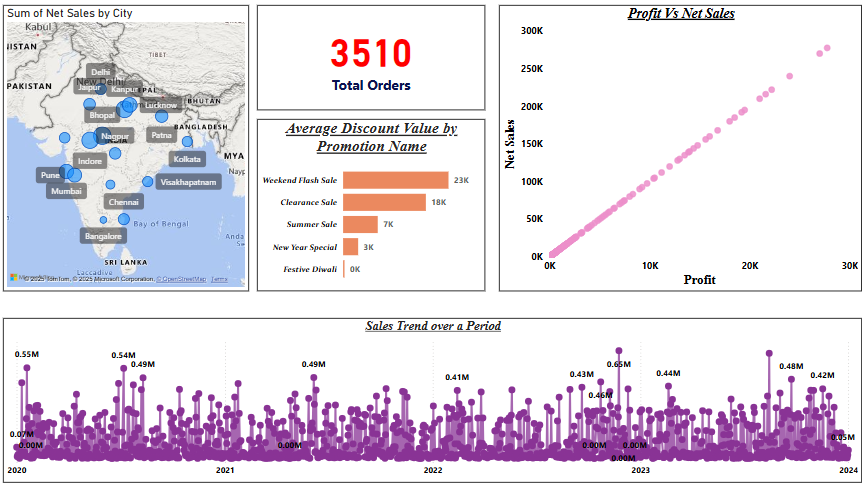
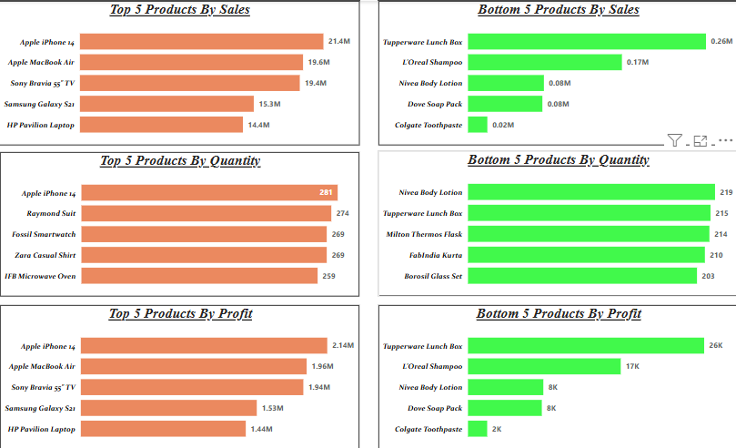
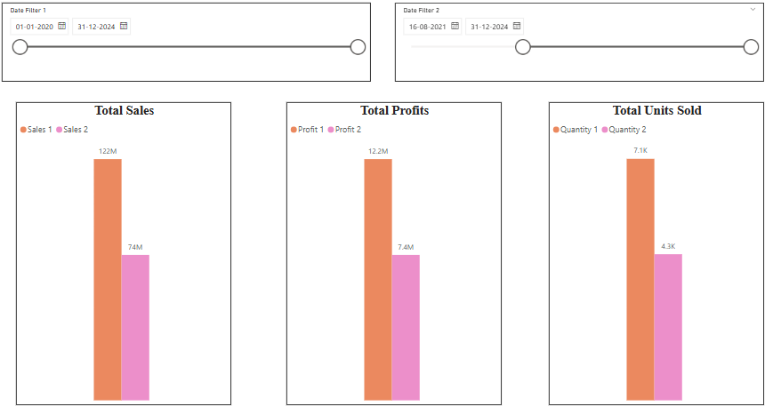
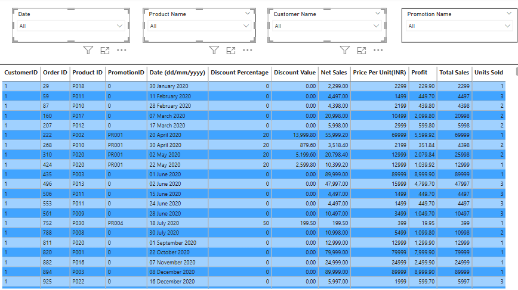

# 🏪 Store Sales Analysis Dashboard – Power BI Project

## 📝 Project Overview

I developed a multi-page Power BI dashboard to analyze **store-level sales data**, focusing on total orders, profit vs. sales insights, top/bottom product performance, and regional sales distribution. This project enables dynamic exploration of key business metrics using interactive visualizations, helping to drive data-informed decisions.

---

## 📁 Project Files
- `SalesDataAnalysis.pbix` – Power BI Desktop file
- `Overview.png` – Sales Overview
- `Top_Bottom_5.png` – Top/Bottom 5 Analysis
- `Comparision.png` – Time-Based Comparison
- `TableVisual.png` – Tabular Summary

---

## 🔧 Tools & Technologies
- Power BI Desktop  
- Power Query  
- DAX (Data Analysis Expressions)  
- Excel *(data source)*

---

## 📌 Dashboard Features

- 📊 **Sales Overview**: Total Orders, Profit vs Sales chart, Net Sales by City, and overall Sales Trend  
- 🏆 **Top & Bottom 5 Analysis**: Highlights best and worst-performing products by Sales, Quantity, and Profit  
- 📈 **Comparative Analysis**: Visualizes changes in Sales, Profit, and Units Sold over different time periods  
- 📋 **Tabular View**: Allows data drill-down using interactive filters and export-ready tables

---

## 📈 Key Insights
- Profitability and sales trends reveal performance gaps across regions
- Top products outperform significantly in both volume and revenue
- Time-based comparison shows consistent growth patterns
- Tabular view supports easy data validation and detailed analysis

---

## 📸 Dashboard Preview

| View | Screenshot |
|------|------------|
| Sales Overview |  |
| Top & Bottom 5 Analysis |  |
| Time-Based Comparison |  |
| Tabular Summary |  |

---

## 📬 How to Use
1. Download or clone the repository
2. Open the `.pbix` file in Power BI Desktop
3. Explore visuals using filters and slicers
4. Use insights for data storytelling or business reporting practice

---

## 📢 Author
**Rushindra Reddy**  
*Aspiring Data Analyst | Power BI | Python | SQL | Data Visualization*  
[LinkedIn Profile](https://www.linkedin.com)
